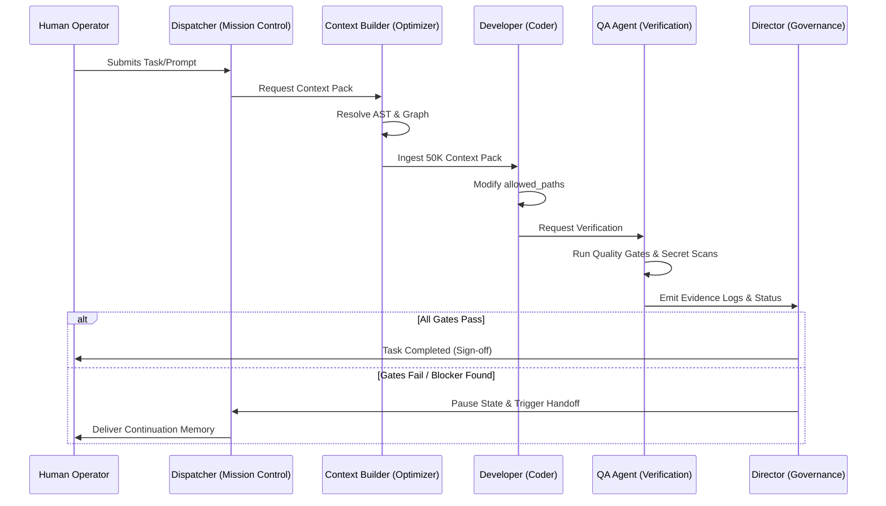

# Y-OS Multi-Agent Network & Interaction Topology

This document details the specialized AI agent roles within the **Y-OS** ecosystem, their interaction protocols, failure boundaries, and the execution topology.

---

## 1. Core AI Agent Roles

The Y-OS architecture distributes task execution across five specialized AI agents. Each agent operates under strict boundaries defined by the Permission Kernel:

### A. Dispatcher Agent (Mission Control)

* **Role**: Primary ingress orchestrator. Parses user requests, splits complex objectives into discrete sub-tasks, and evaluates initial task risk levels.
* **Target Actions**: `TASK_CREATED`, `TASK_STATUS_CHANGED`.
* **Security Bounds**: Cannot read file content directly. Operates only on metadata levels.

### B. Context Builder Agent (Context Optimizer)

* **Role**: Collects, filters, and compresses workspace files into a strict **50K Token Context Pack**. It queries the Knowledge Graph for AST dependencies and ranks target files.
* **Target Actions**: `CONTEXT_INDEX_STARTED`, `CONTEXT_PACK_GENERATED`.
* **Security Bounds**: Read-only access to files. Prohibited from performing writes.

### C. Developer Agent (Coder / Remediator)

* **Role**: Performs the actual code modifications and refactoring. It executes strictly within the task's `ScopePolicy` using the `RepoAdapter`.
* **Target Actions**: `FILE_LOCKED`, `FILE_MODIFIED`.
* **Security Bounds**: Read-write access restricted to the task's `allowed_paths`. All path traversals are blocked.

### D. QA Agent (Quality Gate & Verification)

* **Role**: Executes validation suites, typechecks, linter checks, and secret scans. It registers results into the cryptographic Evidence Store.
* **Target Actions**: `TEST_RUN_STARTED`, `TEST_RUN_PASSED`, `TEST_RUN_FAILED`.
* **Security Bounds**: Executed in a isolated runtime. Cannot modify source codes.

### E. Director Agent (Governance & Handoff)

* **Role**: Evaluates evidence logs and signs off on releases. If a task fails or is blocked, it serializes current state memories and formats continuation handoffs.
* **Target Actions**: `DECISION_ACCEPTED`, `APPROVAL_REQUESTED`, `SNAPSHOT_CREATED`.
* **Security Bounds**: High authority. Requires human override validation for high-risk actions.

---

## 2. Interaction Topology (Work Loop)

The agents operate sequentially in a closed-loop transaction pipeline:

---

## 3. Failure & Block Conditions (When they will NOT work)

The agent network is designed with "fail-loud" boundaries. An agent halts execution immediately when:

| Agent / Subsystem | Primary Trigger | Block / Failure Behavior |
| :--- | :--- | :--- |
| **Dispatcher** | Invalid Auth / Scope | Rejects task creation immediately with HTTP 403. |
| **Context Builder** | Token Budget Overflow | Halts context pack generation if files exceed 50K tokens without successful compression. |
| **Developer** | Path Traversal (`../`) | `RepoAdapter` blocks execution and logs a `REPO_FORBIDDEN_PATH_BLOCKED` security alert. |
| **Developer** | Lock Collision | Fails to acquire file lease if another active worker has locked the target file. |
| **QA Agent** | Secret Leak Detected | Fails the quality gate validation if API keys or passwords are found in output streams. |
| **QA Agent** | Test Suite Failures | Blocks task completion and prevents the Director from issuing a release sign-off. |
| **Director** | Database Connectivity | If Postgres is unreachable (e.g. Supabase DNS timeout), the Director locks execution in offline/mock mode. |
| **Director** | Evidence Tampering | Halts boot if SHA-256 evidence digests mismatch, indicating manual database drift. |
