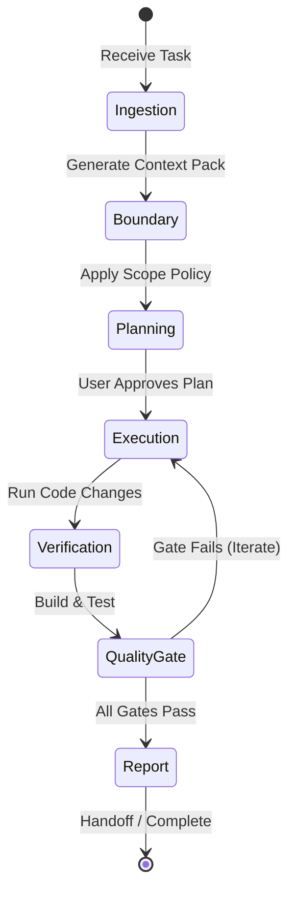

# Y-OS Agent Execution Loop (`loop.md`)

This document defines the structured, iterative execution loop of the Y-OS AI coding agent. The execution loop enforces safety, runs quality gates, and logs all outcomes.

---

## 1. Loop Architecture

The execution loop operates on a **State Machine** model where each step must satisfy specific quality criteria before proceeding.

---

## 2. Detailed Execution Phases

### Phase 1: Ingestion & Context Assembly

* **Action**: Compile relevant repository data (files, AST nodes, dependency paths, recent git diffs) into a task-grounded Context Pack.
* **Constraint**: Total context token size must not exceed the target **50K Token Limit**.
* **Result**: Emits `CONTEXT_PACK_GENERATED` event.

### Phase 2: Boundary & Scope Allocation

* **Action**: Convert the Context Pack info into direct file-level execution rules.
* **Constraint**: Define `allowed_paths`, `forbidden_paths`, and maximum file modification count.
* **Result**: Instantiates the task `ScopePolicy`.

### Phase 3: Planning & Planning Review

* **Action**: Generate the `implementation_plan.md` artifact detailing proposed code updates and testing commands.
* **Constraint**: Highlight any potential breaking changes or critical design decisions for User approval.
* **Result**: Awaiting explicit User signature.

### Phase 4: Execution & Coding

* **Action**: Apply code changes using safe, transaction-aware methods.
* **Constraint**: All modifications must flow through the `RepoAdapter` to ensure path-traversal safety and lock checks.
* **Result**: Generates files and updates the workspace.

### Phase 5: Verification & Testing

* **Action**: Run compilation checks, static type checks, lint checks, and unit tests.
* **Constraint**: If PostgreSQL or external database connectivity is required, separate offline deterministic tests from online integration tests.
* **Result**: Captures test stdout/stderr.

### Phase 6: Quality Gate Orchestration

* **Action**: Run security sweeps (secret scan, path policy compliance) and structural checks.
* **Constraint**: A single failed blocking gate (e.g. compile error or exposed key) aborts completion and returns the loop to the **Execution** phase.
* **Result**: Records gate metrics in the `EvidenceStore`.

### Phase 7: Handoff / Final Report

* **Action**: Generate the `final_report.md` artifact with complete validation logs and changed files diff.
* **Constraint**: Cite cryptographic evidence hashes and timeline events.
* **Result**: Emits `TASK_STATUS_CHANGED` (Completed).

---

## 3. Loop Integrity Rules

1. **Never Self-Certify**: The agent cannot mark a task complete if a quality gate returns warnings or fails.
2. **No Silent Failures**: All validation crashes or database timeouts must fail loud, logging full trace details.
3. **Maximum Iteration Cap**: If a loop fails at the Quality Gate phase 3 times consecutively with the same error, halt execution and prompt the user for input.
