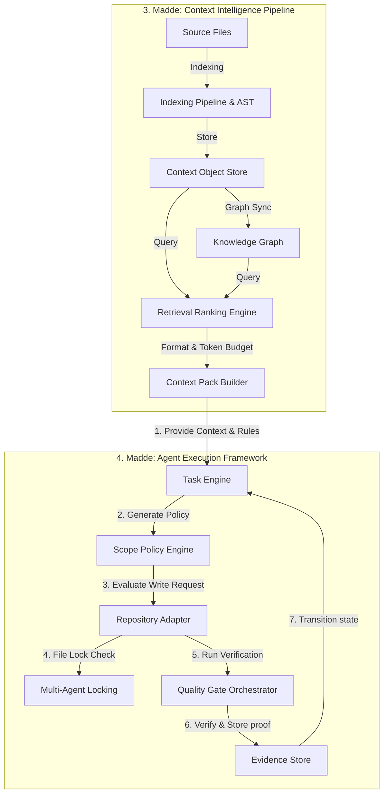

# Y-OS Bağlam Zekası (Context Intelligence) ve Ajan Yürütme (Agent Execution) Uygulama Planı

Bu belge, **Y-OS Çekirdek Yapılandırması** kapsamındaki 3. ve 4. temel maddelerin faz faz nasıl uygulanacağını ve test edileceğini detaylandırmaktadır.

* **3. Madde (Context Intelligence):** Kod tabanından ve harici kaynaklardan gelen bilginin toplanması, analiz edilmesi, ilişkilendirilmesi ve yapay zeka ajanlarının anlayabileceği optimize edilmiş bağlam paketlerine (Context Packs) dönüştürülmesi sürecini yönetir.
* **4. Madde (Agent Execution):** Yapay zeka ajanlarının yetkilendirme, çalışma zamanı sınırları, çakışma engelleme, kalite kapıları ve insan onayı mekanizmaları altında güvenli bir şekilde görevleri yürütmesini sağlar.

---

## Mimariler Arasındaki Veri Akışı

Aşağıdaki akış diyagramı, **Bağlam Zekası İş Hattı (3. Madde)** ile **Ajan Yürütme Çerçevesi (4. Madde)** arasındaki veri geçişini ve koordinasyonu göstermektedir:



---

## 3. Madde: Context Intelligence Pipeline (Faz Faz Uygulama Planı)

Bu iş hattının temel amacı, ajanların çalışacağı projelerdeki dosyaları okuyarak yapısal (AST) ve anlamsal (semantic) ilişkileri çıkarmak ve token sınırına (maksimum 50K) sığan bağlam paketleri üretmektir.

### Faz 3.1: Context Object Store (Bağlam Nesnesi Deposu)

* **Amaç:** Kod dosyaları, dökümanlar ve kararların tekil ve sürüm kontrollü veri tabanı nesnelerine (`context_objects` ve `context_object_refs`) dönüştürülmesi.
* **Etkilenen/Geliştirilecek Dosyalar:**
  * `packages/shared/src/index.ts` (DTO ve Veri Tipleri)
  * `apps/api/src/ContextObjectStoreService.ts` (Veri tabanı okuma/yazma katmanı)
  * `packages/context/src/search-server.ts` (İç bellek/Simülasyon katmanı)
* **Uygulama Adımları:**
  1. `ContextObject` şemasının tanımlanması (ID, proje ID, URI, içerik karması (SHA-256), başlık, ham içerik, dil, tazelik vb.).
  2. Dosyaların sisteme kaydedilirken otomatik olarak temizlenmesi ve normalleştirilmesi.
  3. Nesneler arası referans ve bağlantıların `context_object_refs` tablosuna yazılması.
* **Kabul Kriterleri:**
  * Bellekteki simülasyon katmanı ile veri tabanı şeması birebir eşleşmeli.
  * İçerik karması (hash) uyuşmayan nesneler karantinaya alınmalı.
* **Test Kapısı:**

  ```bash
  npx tsx scripts/validate-stage-31.ts
  ```

### Faz 3.2: Indexing Pipeline & Job Orchestration (Dizinleme İş Hattı)

* **Amaç:** Proje dizinindeki dosyaların güvenli ve sıralı bir biçimde taranarak arka planda otomatik dizinlenmesi.
* **Etkilenen/Geliştirilecek Dosyalar:**
  * `packages/core/src/index-job-service.ts`
  * `packages/core/src/incremental-index-service.ts`
  * `workers/index-worker.ts` (Bağımsız çalışabilir indeksleyici servis)
* **Uygulama Adımları:**
  1. `INDEX_JOB` durum makinesinin kurulması (sıraya alındı, çalışıyor, tamamlandı, hata aldı).
  2. Dizinleme sırasında hassas dosyaların (`.env`, `.pem`, `node_modules`, `dist` vb.) kesin olarak filtrelenmesi.
  3. Değişen dosyaların tespiti için debounced (geciktirilmiş) tetikleyicilerin eklenmesi.
* **Kabul Kriterleri:**
  * İndeksleyici servis, ana API sunucusundan bağımsız bir Worker olarak çalışabilmeli.
  * Hassas dizin veya dosyaların taranması engellendiğinde `REPO_FORBIDDEN_PATH_BLOCKED` olayı tetiklenmeli.
* **Test Kapısı:**

  ```bash
  npm run test:phase7
  ```

### Faz 3.3: AST ve Statik Analiz Katmanı

* **Amaç:** Kod dosyalarındaki bağımlılıkları, içe/dışa aktarmaları (imports/exports) ve fonksiyon çağrılarını çıkararak anlamsal ilişkiler oluşturmak.
* **Etkilenen/Geliştirilecek Dosyalar:**
  * `packages/core/src/static-analysis.ts`
  * `packages/graph/src/index.ts`
* **Uygulama Adımları:**
  1. TypeScript/JavaScript dosyaları için güvenilir bir AST parser entegre edilmesi.
  2. Desteği olmayan diller için Regex tabanlı yedek analiz katmanı (Fallback) kurulması.
  3. AST tabanlı çıkarımlara yüksek güvenilirlik skoru (1.0), Regex çıkarımlarına düşük güvenilirlik skoru (0.4) atanması.
* **Kabul Kriterleri:**
  * AST ayrıştırma hataları tüm dizinleme işlemini çökertmemeli, ilgili dosyayı işaretleyip devam etmeli.
* **Test Kapısı:**

  ```bash
  npx tsx scripts/validate-stage-25.ts
  ```

### Faz 3.4: Knowledge Graph (Bilgi Grafı) Depolama ve Arama

* **Amaç:** AST katmanından çıkan ilişkileri grafik veritabanı yapısında (`graph_nodes` ve `graph_edges`) depolamak ve sorgulamak.
* **Etkilenen/Geliştirilecek Dosyalar:**
  * `packages/graph/src/index.ts`
  * `apps/api/src/index.ts` (Grafik API rotaları)
* **Uygulama Adımları:**
  1. Graf düğüm (Node) ve kenar (Edge) tablolarının oluşturulması.
  2. Projeler arası izolasyonun (multi-tenancy) kesin olarak graf sorgularına yansıtılması.
  3. Etki yarıçapı (impact radius) sorgulama algoritmasının eklenmesi (bir dosya değiştiğinde nereler etkilenir?).
* **Kabul Kriterleri:**
  * Graf sorguları kesinlikle proje sınırlarının dışına çıkmamalı (Cross-project leak engellenmeli).
* **Test Kapısı:**

  ```bash
  npm run test:phase4
  ```

### Faz 3.5: Retrieval Ranking Engine (Arama Sıralama Motoru)

* **Amaç:** Yapay zeka ajanının aramalarında en doğru bağlamı getirmek için çok kriterli bir puanlama motoru oluşturmak.
* **Etkilenen/Geliştirilecek Dosyalar:**
  * `packages/context/src/retrieval-ranking-service.ts`
  * `packages/context/src/search-server.ts`
* **Uygulama Adımları:**
  1. Çok kriterli sıralama formülünün kodlanması:
     $$\text{Score} = 0.30 \times \text{Semantik} + 0.20 \times \text{Graf Yakınlığı} + 0.15 \times \text{Bağımlılık} + 0.10 \times \text{Güncellik} - 0.20 \times \text{Eskilik} - 0.30 \times \text{Yasaklılık}$$
  2. Arama sonuçlarında her bir nesnenin neden getirildiğine dair gerekçelerin (`why_included`) döndürülmesi.
* **Kabul Kriterleri:**
  * Yasaklı/karantinaya alınmış nesnelerin puanı sıfırlanmalı ve arama sonuçlarından filtrelenmeli.
* **Test Kapısı:**

  ```bash
  npx tsx packages/context/test/retrieval-isolation.test.ts
  ```

### Faz 3.6: Context Pack Builder (Bağlam Paketi Oluşturucu)

* **Amaç:** Sıralanan bağlam nesnelerini, kuralları ve kalite gereksinimlerini tek bir taşınabilir JSON paketi haline getirmek.
* **Etkilenen/Geliştirilecek Dosyalar:**
  * `packages/context` altındaki Context Pack servisleri.
  * `apps/web/src/components/AIMissionControlPanel.tsx` (Ön izleme arayüzü)
* **Uygulama Adımları:**
  1. `ContextPack` JSON şemasının ve L0-L3 sıkıştırma seviyelerinin kodlanması.
  2. Üretilen paketin token boyutunun (maksimum 50K) denetlenmesi.
  3. Başarılı üretimlerde `CONTEXT_PACK_GENERATED` olayının tetiklenmesi.
* **Kabul Kriterleri:**
  * Paket içerisinde projenin yasaklı alanlarına dair referanslar veya gizli anahtarlar yer almamalı.
* **Test Kapısı:**

  ```bash
  npm run test:ai-cockpit
  ```

---

## 4. Madde: Agent Execution Framework (Faz Faz Uygulama Planı)

Bu çerçevenin amacı, üretilen bağlam paketini baz alarak, ajanların eylemlerini izole etmek, dosya yazma yetkilerini doğrulamak ve çalışmanın doğruluğunu kanıtlarla tescillemektir.

### Faz 4.1: Scope / Boundary Policy Engine (Sınır Politikası)

* **Amaç:** Ajanın yapabileceği değişikliklerin sınırlarını belirlemek ve yetkisiz yazma işlemlerini engellemek.
* **Etkilenen/Geliştirilecek Dosyalar:**
  * `packages/core/src/repo-adapter.ts`
  * `apps/api/src/PermissionKernelService.ts`
* **Uygulama Adımları:**
  1. `SCOPE_POLICY` nesnesinin oluşturulması (izin verilen yollar, yasaklı yollar, maksimum dosya boyutu değişimi).
  2. `RepositoryAdapter` üzerindeki tüm yazma (`writeFile`, `deleteFile`) işlemlerinin bu politikalardan geçirilmesi.
  3. Kural ihlallerinde yazmanın durdurulup güvenlik olayının loglanması.
* **Kabul Kriterleri:**
  * Dosya sistemine doğrudan yazma yapılmadan önce politika denetimi başarısız olursa işlem durdurulmalı.
* **Test Kapısı:**

  ```bash
  npx tsx scripts/validate-stage-22.ts
  ```

### Faz 4.2: Task Engine Lifecycle (Görev Durum Makinesi)

* **Amaç:** Ajan görevlerinin yaşam döngüsünü durum geçiş kuralları (FSM) ile yönetmek.
* **Etkilenen/Geliştirilecek Dosyalar:**
  * `apps/api/src/TaskLifecycleService.ts`
  * `apps/web/src/hooks/useTaskLifecycle.ts`
* **Uygulama Adımları:**
  1. Durumların tanımlanması: `CREATED` $\rightarrow$ `ANALYZING` $\rightarrow$ `CONTEXT_PACK_READY` $\rightarrow$ `RUNNING` $\rightarrow$ `VERIFYING` $\rightarrow$ `COMPLETED/FAILED`.
  2. Her durum geçişinin `event_records` tablosuna olay (event) olarak yazılması.
  3. İzin verilmeyen durum geçişlerinin (örneğin doğrudan `CREATED` durumundan `COMPLETED` durumuna geçiş) engellenmesi.
* **Kabul Kriterleri:**
  * Manuel durum zorlamaları (Admin override) denetlenmeli ve denetim kayıtlarına yazılmalı.
* **Test Kapısı:**

  ```bash
  npx tsx scripts/validate-stage-27.ts
  ```

### Faz 4.3: Quality Gate Orchestrator & Evidence Store (Kalite ve Kanıt Çekirdeği)

* **Amaç:** Ajanın işi bitirmesi için gerekli test ve derleme (build) süreçlerini çalıştırmak ve bunları SHA-256 imzalı kanıtlar olarak kaydetmek.
* **Etkilenen/Geliştirilecek Dosyalar:**
  * `apps/api/src/QualityGateService.ts`
  * `apps/api/src/EvidenceStoreService.ts`
* **Uygulama Adımları:**
  1. Kalite kapısı durum modelinin oluşturulması (geçti, kaldı, atlandı).
  2. Test sonuçlarının, konsol loglarının ve ekran görüntülerinin `evidence_records` tablosuna SHA-256 içerik özetiyle kaydedilmesi.
  3. Kritik kalite kapısı adımları atlandığında görevin başarılı sayılmasının engellenmesi.
* **Kabul Kriterleri:**
  * Değiştirilen kanıt kayıtlarının tespiti için SHA-256 doğrulaması yapılmalı.
* **Test Kapısı:**

  ```bash
  npx tsx scripts/validate-stage-28.ts
  ```

### Faz 4.4: Scheduler / Queue & Worker Runtime (Zamanlayıcı ve Çalışma Ortamı)

* **Amaç:** Ajan ve dizinleme görevlerinin kuyruk yapısında, güvenli ve sıralı bir biçimde çalıştırılması.
* **Etkilenen/Geliştirilecek Dosyalar:**
  * `apps/api/src/WorkerRuntimeService.ts`
  * `workers/index-worker.ts`
* **Uygulama Adımları:**
  1. Öncelikli kuyruk (Queue) yapısının veritabanı destekli kurulması.
  2. Çalışma sırasında çöken veya yanıt vermeyen Worker kilitlerinin otomatik olarak serbest bırakılması (Heartbeat izleme).
* **Kabul Kriterleri:**
  * Donan veya durdurulan işler belirlenen maksimum yeniden deneme (retry) limitini aşınca otomatik olarak `FAILED` durumuna düşürülmeli.
* **Test Kapısı:**

  ```bash
  npx tsx scripts/validate-stage-32.ts
  ```

### Faz 4.5: Multi-Agent Locking & Concurrency (Eşzamanlılık Kilitleme)

* **Amaç:** Birden fazla ajanın aynı dosyalara aynı anda yazarak kod tabanını kirletmesini engellemek.
* **Etkilenen/Geliştirilecek Dosyalar:**
  * `apps/api/src/FileLockingService.ts`
  * `packages/core/src/repo-adapter.ts`
* **Uygulama Adımları:**
  1. Dosya bazlı kilit türlerinin (`read`, `write`, `exclusive`) tanımlanması ve `file_locks` tablosunda saklanması.
  2. Yazma işlemi başlamadan önce aktif kilit denetimi yapılması.
  3. İlişkili dosyalarda çakışma riski varsa (AST analizi ile) ajanın uyarılması.
* **Kabul Kriterleri:**
  * Aynı dosyaya kilit süresi dolmadan ikinci bir yazma işlemi kesinlikle engellenmeli.
* **Test Kapısı:**

  ```bash
  npx tsx scripts/validate-stage-33.ts
  ```

### Faz 4.6: Secret Vault & Permission Kernel (Kimlik ve Yetkilendirme)

* **Amaç:** Ajanların harici bağlantı bilgilerine (Supabase, GitHub token vb.) erişimlerini yetkilendirmek ve çıktı loglarından bu sırları temizlemek.
* **Etkilenen/Geliştirilecek Dosyalar:**
  * `apps/api/src/PermissionKernelService.ts`
  * `packages/security/src/index.ts`
* **Uygulama Adımları:**
  1. Varsayılan olarak her şeye erişimi engelleyen "Default Deny" kuralının çekirdeğe gömülmesi.
  2. API yanıtları, test logları ve kanıt dökümanlarındaki şifre veya gizli anahtar (credential) kalıplarının düzenli ifadelerle (regex) temizlenmesi (Redaction).
* **Kabul Kriterleri:**
  * `DATABASE_URL` veya `GEMINI_API_KEY` içeren hiçbir metin ham haliyle dosyalara veya veri tabanına yazılmamalı.
* **Test Kapısı:**

  ```bash
  npx tsx scripts/validate-stage-34.ts
  npm run secret-scan
  ```
