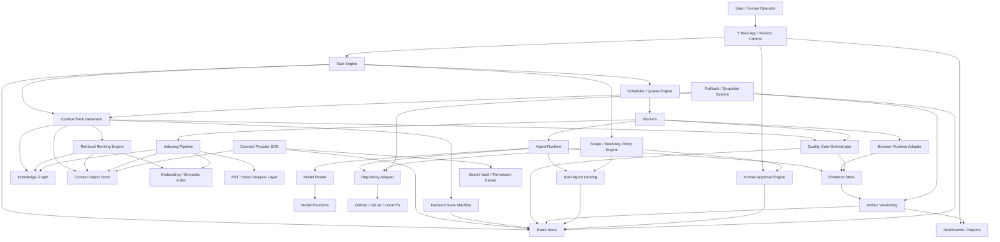
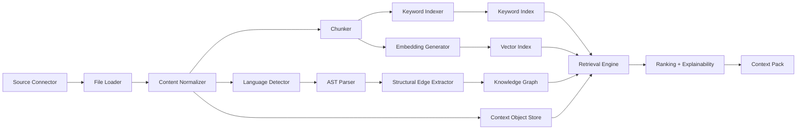
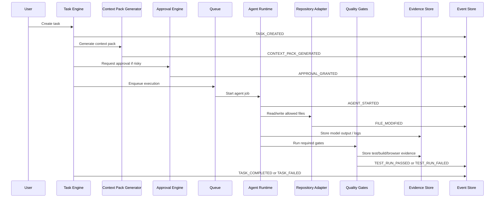
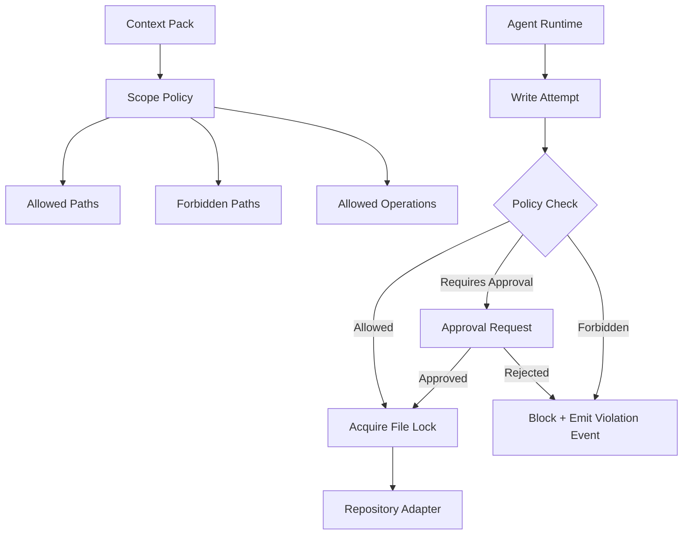
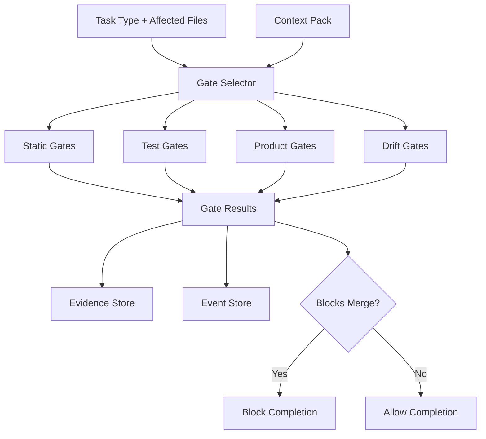

# Y — Engineering Architecture Schema

> Target architecture reference, not proof that every listed module exists.
> Current implementation status is tracked in `implementation.md` and
> `docs/kernel-debt-register.md`.

## 1. High-level architecture



---

## 2. Core kernel objects

```mermaid
erDiagram
    PROJECT ||--o{ TASK : owns
    PROJECT ||--o{ CONTEXT_OBJECT : contains
    PROJECT ||--o{ GRAPH_NODE : has
    PROJECT ||--o{ EVENT : records
    PROJECT ||--o{ ARTIFACT : produces
    PROJECT ||--o{ CONNECTION : uses
    PROJECT ||--o{ PERMISSION_GRANT : controls

    TASK ||--o{ EVENT : emits
    TASK ||--o{ CONTEXT_PACK : generates
    TASK ||--o{ EVIDENCE : collects
    TASK ||--o{ GATE_RESULT : validates
    TASK ||--o{ APPROVAL_REQUEST : waits_for
    TASK ||--o{ FILE_LOCK : locks
    TASK ||--o{ SNAPSHOT : snapshots
    TASK ||--o{ ARTIFACT : outputs

    CONTEXT_OBJECT ||--o{ CHUNK : chunked_into
    CONTEXT_OBJECT ||--o{ GRAPH_NODE : represented_by

    GRAPH_NODE ||--o{ GRAPH_EDGE : from
    GRAPH_NODE ||--o{ GRAPH_EDGE : to

    CONTEXT_PACK ||--o{ CONTEXT_PACK_ITEM : includes
    CONTEXT_PACK ||--o{ QUALITY_GATE : requires
    CONTEXT_PACK ||--o{ DECISION : references

    EVIDENCE ||--o{ ARTIFACT : supports
    QUALITY_GATE ||--o{ GATE_RESULT : produces
    DECISION ||--o{ EVENT : changes_state
```

---

## 3. Indexing and retrieval architecture



---

## 4. Agent execution architecture



---

## 5. Boundary enforcement architecture



---

## 6. Quality gate architecture



---

## 7. Storage/service boundaries

```txt
apps/web
├── Mission Control UI
├── Project Dashboard
├── Context Graph UI
├── Task Board
├── Artifact Center
├── Debug Console
└── Approval UI

packages/kernel
├── event-store
├── task-engine
├── context-pack
├── policy-engine
├── permission-engine
├── quality-gates
├── evidence
├── artifacts
├── snapshots
└── decisions

packages/indexing
├── source-loaders
├── content-normalizer
├── ast-adapters
├── chunker
├── embedding
├── keyword-index
└── graph-builder

packages/graph
├── node-store
├── edge-store
├── traversal
├── impact-analysis
└── drift-detection

packages/providers
├── repo-adapters
├── connect-providers
├── model-providers
├── browser-runtime
└── mcp-providers

workers
├── index-worker
├── agent-worker
├── gate-worker
├── artifact-worker
├── browser-worker
└── resume-worker
```

---

## 8. Recommended MVP architecture boundary

The MVP should not implement all Y modules.

The first production-grade engineering slice should be:

```txt
GitHub Connect
→ Indexing Pipeline
→ AST + Graph
→ Context Object Store
→ Retrieval Ranking
→ Context Pack Generator
→ Scope Policy
→ Claude/Cursor handoff
→ Quality Gates
→ Final Report
```

This slice proves the most important claim:

> Y gives AI agents the right project context and prevents unsafe, unrelated changes.
