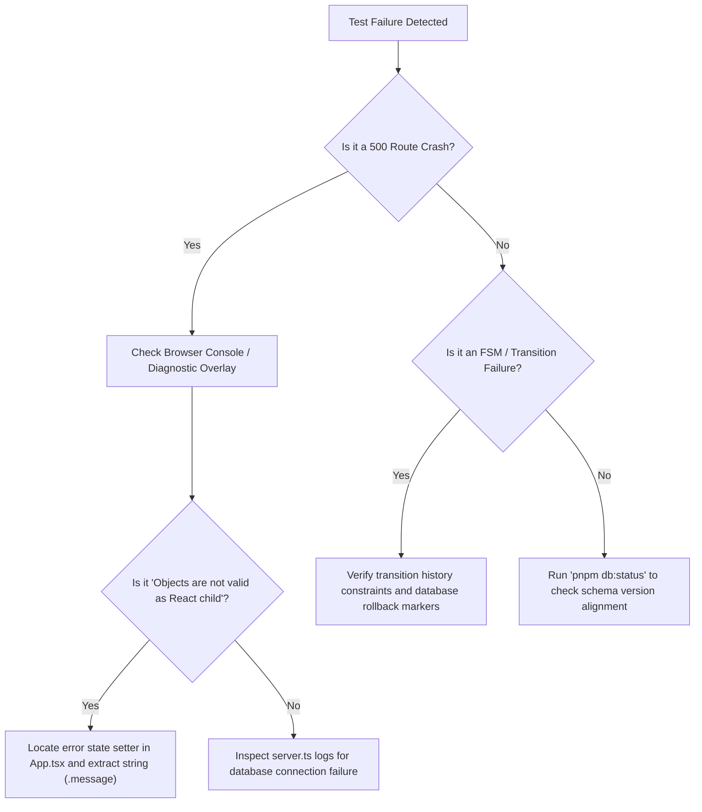

# Y-OS Master Unified Verification & Test Plan

This document serves as the master chronological verification framework for the **Y Context Operating System**. It consolidates phase-by-phase coverage, API routes, DTO schemas, execution harnesses, and deferred-scope boundaries.

---

## Part 1: QA & Execution Harness Baseline

### 1. Active Test Runner Command Suite
Formal validation and baseline integrity checks are split across multiple automated script pipelines. Running arbitrary custom queries or mutating database rows outside these harnesses is strictly prohibited.

```bash
# Execute Phase 1–26 (Vault & Ingestion segments, ~441 tests)
pnpm test

# Execute Stage 27–35 (FSM, Quality, Evidence, Workers, Locking, ABAC, and CAS, ~587 tests)
# Because these stage validators are separate modular scripts not bound in package.json,
# they must be run individually:
npx tsx scripts/validate-stage-27.ts
npx tsx scripts/validate-stage-28.ts
npx tsx scripts/validate-stage-29.ts
npx tsx scripts/validate-stage-30.ts
npx tsx scripts/validate-stage-31.ts
npx tsx scripts/validate-stage-32.ts
npx tsx scripts/validate-stage-33.ts
npx tsx scripts/validate-stage-34.ts
npx tsx scripts/validate-stage-35.ts

# Run static codebase inspections
pnpm lint
pnpm typecheck
pnpm build

# Inspect secret scanning and debug-tag guardrails
pnpm secret-scan
pnpm qa:debug-tags

# Check PostgreSQL connection and migration status
pnpm db:status
```

### 2. Recorded Validation Baseline Metrics
The approved Quality Gate baseline requires all existing automated checks to pass cleanly with **zero failures** before any commit or release.

| Validation Group / Stage | Passed Cases | Failed Cases | Target Focus |
|---|---|---|---|
| **Stage 35 (Artifact Versioning / CAS)** | 162 | 0 | Locally measured deterministic assertions; live DB checks may still be simulated |
| **Stage 34 (Permission Kernel / ABAC)** | 61 | 0 | Subject/Resource access evaluation gates |
| **Stage 33 (File Locking)** | 51 | 0 | Pessimistic concurrent write locking blocks |
| **Stage 32 (Worker Runtime)** | 47 | 0 | Concurrency limits and worker registrations |
| **Stage 31 (ContextObject Store)** | 109 | 0 | Cache segment isolation and stale tracking |
| **Stage 30 (Event Store)** | 25 | 0 | Locally measured offline assertions; live trigger checks are reported separately |
| **Stage 29 (Evidence Store)** | 32 | 0 | Verification result tracking ledger |
| **Stage 28 (Quality Gate Orchestrator)** | 26 | 0 | Pre-commit static scans and build checks |
| **Stage 27 (Task Lifecycle FSM)** | 32 | 0 | Transition validation rules and rollbacks |
| **Segment 1–10 (Ingestion & Graph)** | 97 | 0 | Document parsing, token caps, and edges |
| **Segment 11–14 (AST & Dependency)** | 57 | 0 | Symbol extraction and structural links |
| **Segment 15–18 (Aide Memories & Timers)**| 107 | 0 | Checkpoint stubs and scheduled schedules |
| **Segment 19–21 (Handoff & Debug)** | 70 | 0 | Role transitions and masked console logs |
| **Segment 20–26 (DB Sec, Job Queuing)** | 110 | 0 | Row scope rules and job prioritization |
| **Historical Claimed Total** | **1028** | **0** | Not an active release gate until reproduced by `npm run test:db` with zero skips |

### 3. Database Validation Philosophy: Fail-Loud vs. Simulation
* **Mock Database Mode (`ENABLE_MOCK_DB=true`):** Permitted **only** for local client smoke testing and isolated router evaluations in sandboxed environments.
* **Production Validation Rule:** Simulation mocks are **strictly unauthorized** for formal validation and security testing. In accordance with the baseline database rules (`database-foundation.md`), database connections must run against a real PostgreSQL instance with active TLS certificate verification and fail loudly (crashing the boot loop immediately) if connection coordinates are invalid or certificates are missing.

---

## Part 2: Chronological Phase-by-Phase MVP-Correct Test Plan

This section provides granular test cases, strict boundaries, and exact failure indicators for both active MVP features and upcoming roadmap phases.

---

### Phase 16: Agent Timeline MVP

#### 1. Test Metadata & Preconditions
* **Test Area:** Continuity & Auditing
* **API Endpoints:**
  - `GET /api/projects/:id/tasks/:taskId/timeline` (Task-specific chronological stream)
  - `GET /api/projects/:id/tasks/:taskId/timeline/summary` (Timeline state summary DTO)
  - `GET /api/projects/:id/timeline` (Project-level chronological stream)
* **API Middlewares Active:** `requireProjectScope` (Enforces project-scoped permission checks)
* **Canonical Source:** `event_records`
* **Compatibility Fallback Sources:** `audit_logs`, `agent_memories`, `resume_states`, `resume_schedules`, `agent_sessions`, `agent_handoffs`, `tasks`

#### 2. Structured Test Cases

##### Test Case 16.1: Chronological Order & DTO Schema [ACTIVE MVP - TESTABLE TODAY]
* **Objective:** Verify that canonical task events are projected—and legacy records are compatibility-normalized only when required—into a flat array of correctly spelled `TimelineEventDTO` items.
* **Preconditions:** Active task `task_jwt_samesite` exists under project `proj_92c` with events present in `audit_logs` and `agent_handoffs`.
* **Input Request:** `GET /api/projects/proj_92c/tasks/task_jwt_samesite/timeline`
* **Expected Output DTO (Flat Array of `TimelineEventDTO`):**
  - Status `200 OK`
  - Body must be a **flat JSON array**, not wrapped inside `{ timeline: [...] }`.
  - Each item must strictly implement the verified DTO keys:
    * `source_type` (Spelled exactly as `source_type`, NOT `source`)
    * `event_type` (Spelled exactly as `event_type`, NOT `eventType`)
    * `summary` (Contains description of event, spelled exactly as `summary`, NOT `description`)
    * `status` (Event status flag, spelled exactly as `status`, NOT `severity`)
    * `timestamp` (ISO datetime string)
    * `metadata` (JSON block. Any actor credentials must reside *inside* this metadata or inside the `summary` string, never on the root object).
* **Verification Code Check:**
  ```javascript
  const res = await fetch('/api/projects/proj_92c/tasks/task_jwt_samesite/timeline');
  const body = await res.json();
  console.assert(Array.isArray(body), "Expected response to be a flat array!");
  
  const hasInvalidKeys = body.some(event => {
    return 'source' in event || 'eventType' in event || 'description' in event || 'severity' in event || 'actor' in event;
  });
  console.assert(!hasInvalidKeys, "Detected invalid DTO keys from previous obsolete specifications!");

  const times = body.map(t => new Date(t.timestamp).getTime());
  const isSorted = times.every((val, i) => i === 0 || times[i-1] >= val);
  console.assert(isSorted === true, "Timeline is not sorted in descending chronological order!");
  ```

##### Test Case 16.2: Tolerant Parsing & Warning Injection [ACTIVE MVP - TESTABLE TODAY]
* **Objective:** Ensure that missing metadata or corrupted records inside source tables do not trigger server crashes (500), but inject visible warning indicators.
* **Preconditions:** Insert an `audit_logs` record associated with `task_jwt_samesite` that contains corrupted/empty JSON values in the `metadata_json` column.
* **Input Request:** `GET /api/projects/proj_92c/tasks/task_jwt_samesite/timeline/summary`
* **Expected Output DTO:**
  - Status `200 OK`.
  - Body contains a flat summary structure detailing warning counts or parsed items.
  - Generates clear warning diagnostics without fabricating missing timestamps or summary actions.

##### Test Case 16.3: Local Execution Bound (No LLM Calls) [ACTIVE MVP - TESTABLE TODAY]
* **Objective:** Guarantee absolute offline compliance. Querying the timeline must never invoke external model API keys or execute background agent loops.
* **Verification Method:** Trace outbound connections during a heavy timeline query load.
* **Expected Result:** Execution completes immediately under standard single-thread event loop execution, confirming no synchronous lockups or blocking operations. Zero outgoing TLS requests to `generativelanguage.googleapis.com` or other external targets.

#### 3. Failure Indicators
* ❌ **Obsolete Keys:** Output items contain `source`, `eventType`, or `description` fields, causing front-end interface rendering crashes.
* ❌ **Nest Wrap:** API returns `{ timeline: [...] }` wrapper, making `body.map()` crash with an undefined object exception.
* ❌ **Cross-Project Scope Leak:** Making a request to `GET /api/projects/proj_B/tasks/task_scoped_to_proj_A/timeline` successfully returns records instead of throwing `404 Not Found` or `403 Permission Denied`.

---

### Phase 17: Event Store & Context Store Core

#### 1. Test Metadata & Preconditions
* **Test Area:** Event Sourcing & Ingestion Scope
* **Active MVP Stage:** Stage 30 & Stage 31

#### 2. Structured Test Cases

##### Test Case 17.1: Event Append-Only Immutability [ACTIVE MVP - TESTABLE TODAY]
* **Objective:** Ensure the basic `event_records` table prevents any updates or deletions at the database level.
* **Execution SQL Statements:**
  ```sql
  UPDATE event_records SET payload = '{"tampered": true}' WHERE id = 'event_001';
  DELETE FROM event_records WHERE id = 'event_001';
  ```
* **Expected Result:** Database trigger rejects query instantly. Row remains unchanged.

##### Test Case 17.2: State Reconstruction from Event Replay [FUTURE PRODUCTION-KERNEL CONTRACT - DEFERRED]
* **Objective:** Reconstruct complete workspace FSM states by replaying log payloads from time `T=0`.
* **Boundary Warning:** This is a **Production-Kernel Contract**. It is **strictly absent** in the current MVP. Attempting to execute state replay commands today will fail since the projection and replay engine are stubs. Tests for this are deferred to future authorization cycles.

##### Test Case 17.3: ContextObject Segment Scope Isolation [ACTIVE MVP - TESTABLE TODAY]
* **Objective:** Ensure semantic files and token chunks are isolated by project namespaces.
* **Verification Method:** Attempt to query a `context_items` UUID belonging to `proj_A` from a `proj_B` API context.
* **Expected Result:** Request rejected with `PermissionDeniedError` (403).

---

### Phase 18: RepoAdapter Virtualization & Job Queue MVP

#### 1. Test Metadata & Preconditions
* **Test Area:** Resource Security & Ingestion Scheduling
* **Active MVP Stage:** Stage 32

#### 2. Structured Test Cases

##### Test Case 18.1: Directory Traversal Blockade [ACTIVE MVP - TESTABLE TODAY]
* **Objective:** Verify that `RepoAdapter` denies all attempts to access directories outside the workspace root or access highly-sensitive configuration files.
* **Input Path Parameters:** `../../.env`, `..\..\secrets.json`, `/etc/passwd`.
* **Expected Result:** Blocked immediately. Emits `ContextBoundaryViolationError` (400) and writes a security audit log event.

##### Test Case 18.2: Concurrency Cap and Job Priority [ACTIVE MVP - TESTABLE TODAY]
* **Objective:** Ensure that workers claim pending `index_jobs` strictly by priority (High ➔ Medium ➔ Low) and concurrency thresholds are respected.
* **Expected Result:** Job queue scheduler successfully enforces locks, preventing a single worker thread from exceeding concurrent limits. Stale jobs (> 15 minutes) are swept and safely re-queued.

---

### Phase 19: AST Parser & Grounded Search Server

#### 1. Test Metadata & Preconditions
* **Test Area:** Semantic Grounding & Symbol Extraction

#### 2. Structured Test Cases

##### Test Case 19.1: AST Symbol Extraction & Regex Fallback [ACTIVE MVP - TESTABLE TODAY]
* **Objective:** Verify that uploading code files successfully extracts TSX symbols (imports, exports, JSX tags), while syntactically broken files fall back gracefully to regular expressions without throwing exceptions.
* **Expected Result:** `TypeScriptASTParser` parses healthy files. Broken code routes to `RegexFallbackParser`, logging a warning code check without a server-side 500 crash.

##### Test Case 19.2: Grounded Task relevance Grounding [ACTIVE MVP - TESTABLE TODAY]
* **Objective:** Confirm lexical-overlap relevance queries retrieve candidates isolated by project.
* **Expected Result:** The current approximate lexical scorer returns matching fragments scoped to the queried project ID only, with zero cross-tenant metadata bleed. True BM25, embeddings, and cosine ranking remain KDEBT-007 work.

---

### Phase 20: Incremental Indexing Pipeline MVP

#### 1. Test Metadata & Preconditions
* **Test Area:** Code Ingestion & Watchers
* **API Endpoints:**
  - `GET /api/projects/:id/incremental-index/status` (Retrieves active file watcher and pipeline status)
  - `GET /api/projects/:id/incremental-index/events` (Queries logged file change and indexing events)
  - `POST /api/projects/:id/incremental-index/events` (Registers a manual file-edit or watch event)
  - `POST /api/projects/:id/incremental-index/scan-path` (Triggers targeted AST/Regex symbol scan for a file path)
  - `POST /api/projects/:id/incremental-index/rebuild-delta` (Computes delta hashes and queues reindexing task)
* **API Middlewares Active:** `requireProjectScope` (Enforces project bounds)

#### 2. Structured Test Cases

##### Test Case 20.1: Incremental Index Status & Events [ACTIVE MVP - TESTABLE TODAY]
* **Objective:** Query the current active state of the indexing watchers and confirm events are queried in flat array lists.
* **Input Request:** `GET /api/projects/proj_92c/incremental-index/status`
* **Expected Output:** Status `200 OK`, returns a JSON object detailing whether watch mode is enabled (defaults to `false` in development/production as per guidelines to avoid blocking normal API requests) and listing system state.
* **Input Request 2:** `GET /api/projects/proj_92c/incremental-index/events`
* **Expected Output 2:** Status `200 OK`, returns a flat array of registered delta indexing events.

##### Test Case 20.2: Trigger Single File Scan & Rebuild Delta [ACTIVE MVP - TESTABLE TODAY]
* **Objective:** Trigger a manual AST path scan and delta hash recalculation for a modified file path.
* **Input Request:** `POST /api/projects/proj_92c/incremental-index/scan-path` with payload `{"path": "src/utils/security.ts"}`
* **Expected Output:** Status `200 OK` (or successfully registered).
* **Input Request 2:** `POST /api/projects/proj_92c/incremental-index/rebuild-delta` with payload `{"path": "src/utils/security.ts"}`
* **Expected Output 2:** Status `200 OK`. Delta hash matches the new file contents, and the index queue updates without duplicate job allocations (debounced).

#### 3. Failure Indicators
* ❌ **Blocking Event Loop:** Executing `rebuild-delta` synchronously traverses files and blocks Express from serving concurrent API calls.
* ❌ **Missing Parameter Validation:** Attempting to scan a path outside the workspace (e.g. `../../etc/passwd`) does not fail with path limits but parses successfully (critical directory traversal leakage).

---

### Stage 27 & 28: FSM Task Engine & Quality Gate Middleware

#### 1. Test Metadata & Preconditions
* **Test Area:** Task Management & Pipeline Quality Gates
* **Active MVP Stage:** Stage 27 & Stage 28

#### 2. Structured Test Cases

##### Test Case S27.1: FSM State Transition Validation [ACTIVE MVP - TESTABLE TODAY]
* **Objective:** Verify that task status fields can only be modified through FSM triggers (`start`, `pause`, `resume`, `complete`, `cancel`), rejecting direct CRUD updates.
* **Expected Result:** Attempting to transition from `pending` directly to `completed` is rejected. Permitted transitions (e.g. `pending` ➔ `running`) complete successfully and record history logs.

##### Test Case S28.1: Quality Gate Secret Leak Blockade [ACTIVE MVP - TESTABLE TODAY]
* **Objective:** Ensure that committing a code file containing plaintext secrets or syntax errors is blocked in the pre-commit pipeline.
* **Input Code Payload:** Contains `const SECRET = "sk-proj928103..."` or raw credentials.
* **Expected Result:** Gate runner blocks the commit, returns a `SECRET_LEAK_PREVENTED` exception, and records a security audit log.

---

### Phase 21: Cryptographic Evidence Ledger & Workers

#### 1. Test Metadata & Preconditions
* **Test Area:** Security Assurances & Multithreading
* **Active MVP Stage:** Stage 29

#### 2. Structured Test Cases

##### Test Case 21.1: Evidence Store Token Signatures [FUTURE PRODUCTION-KERNEL CONTRACT - DEFERRED]
* **Objective:** Generate cryptographically signed evidence tokens verifying execution inputs.
* **Boundary Warning:** This is a **Production-Kernel Contract**. The current MVP verifies SHA-256 content digests only; it has no signing keys, signer identity, or signature verification. Signature tests are deferred until those primitives exist.
* **Active MVP Testable Scope:** Verify that evidence material is hashed with SHA-256 and tampering is detected. Verification status fields are mutable; actor signatures are not implemented.

##### Test Case 21.2: Asynchronous Event-Loop Isolation [ACTIVE MVP - TESTABLE TODAY]
* **Objective:** Verify that executing long background indexing schedules does not block the Express event loop thread.
* **Expected Result:** Express event loop remains completely unblocked; concurrent requests to `/health` are served normally without significant latency spikes or timeout regressions.

---

### Phase 22: File Locking & ABAC Access Kernel

#### 1. Test Metadata & Preconditions
* **Test Area:** Access Controls & Concurrency Locks
* **Active MVP Stage:** Stage 33 & Stage 34

#### 2. Structured Test Cases

##### Test Case 22.1: Concurrent Write Locks & Lease Swipes [ACTIVE MVP - TESTABLE TODAY]
* **Objective:** Ensure concurrent write lock requests on a single file path are serialized and blocked.
* **Expected Result:** Session A holds the lock. Session B's write attempt is immediately blocked with `FileLockedError` until Session A releases the lock or the lock lease duration naturally expires and is swept by the lock sweeper.

##### Test Case 22.2: ABAC Default-Deny Policy Rules [ACTIVE MVP - TESTABLE TODAY]
* **Objective:** Enforce default-deny attributes parsing on all workspace endpoints.
* **Expected Result:** Any subject or resource request that does not explicitly match the defined policy matrix is denied by default (403), preventing data leakage. Admin overrides must record a detailed written rationale inside `audit_logs`.

---

### Phase 23: CAS Artifact Store with Lineage Diff

#### 1. Test Metadata & Preconditions
* **Test Area:** Content-Addressable Storage
* **Active MVP Stage:** Stage 35

#### 2. Structured Test Cases

##### Test Case 23.1: Cryptographic Deduplication [ACTIVE MVP - TESTABLE TODAY]
* **Objective:** Verify that uploading multiple copies of identical files—either across different logical paths or different versions within the same project—results in exactly one underlying `cas_blobs` record.
* **Expected Result:** Both path A and path B point to the same `cas_blob_id` record. Duplicate storage rows are prevented.

##### Test Case 23.2: Project-Scoped CAS Isolation [ACTIVE MVP - TESTABLE TODAY]
* **Objective:** Ensure CAS deduplication is strictly project-scoped.
* **Expected Result:** Uploading identical files in Project A and Project B **must create separate** `cas_blobs` records scoped to their respective namespaces, blocking vertical cross-tenant metadata leakage.

---

## Part 3: Deferred Boundaries & Scope Compliance

The following features remain outside the active roadmap until they receive explicit design and acceptance criteria. Their test specifications are conceptual blueprints for subsequent stages.

### 🚫 Prohibited Area 1: Workspace Snapshot & Rollback
* **Reason:** Creates out-of-scope post-production snapshot capabilities. Atomic backup and rollback routines (`POST /api/workspace/snapshot` and `/rollback`) **do not exist** in the current codebase.
* **Compliance Action:** Do not write or register testing endpoints or execute rollback scripts. Database state must strictly remain append-only.

### 🚫 Prohibited Area 2: Browser Sandboxed Preview Runtimes
* **Reason:** Running automated worker code or custom component scripts inside sandboxed iframe wrappers is out of bounds for the current Kernel MVP release architecture.
* **Compliance Action:** Omit any testing wrappers for iframe-isolated runtime scripts. Static file review remains server-side only.

---

## Part 4: Release Definition of Done (DoD) & Bug Triaging

### 1. Release Definition of Done
To approve a stable release, the following checklist must be fully satisfied:
1. **Deterministic Validation Green:** `npm run test:deterministic` completes with zero failed targets. Reported DB skip markers are informational only for this local suite and do not satisfy production release.
2. **PostgreSQL Validation Green:** `npm run test:db` completes with zero failures and zero skipped critical checks.
3. **Build Integrity:** `npm run build` completes without the 500 kB client chunk warning.
4. **Secret Cleanliness:** `npm run secret-scan` confirms zero detected plain-text passwords or keys.
5. **Redactor Active:** Verification that credentials, API keys, and database passwords are recursively redacted from API output streams.
6. **Schema Alignment:** the strict DB suite confirms schema version `1.3.4-artifact-cas-mvp`.

### 2. Failure Triaging Playbook
If a smoke test or automated run fails, testers must triage using the following roadmap:


